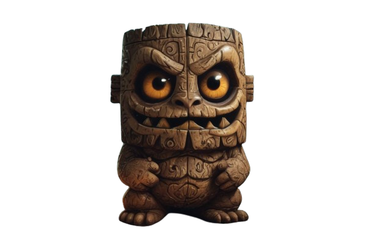
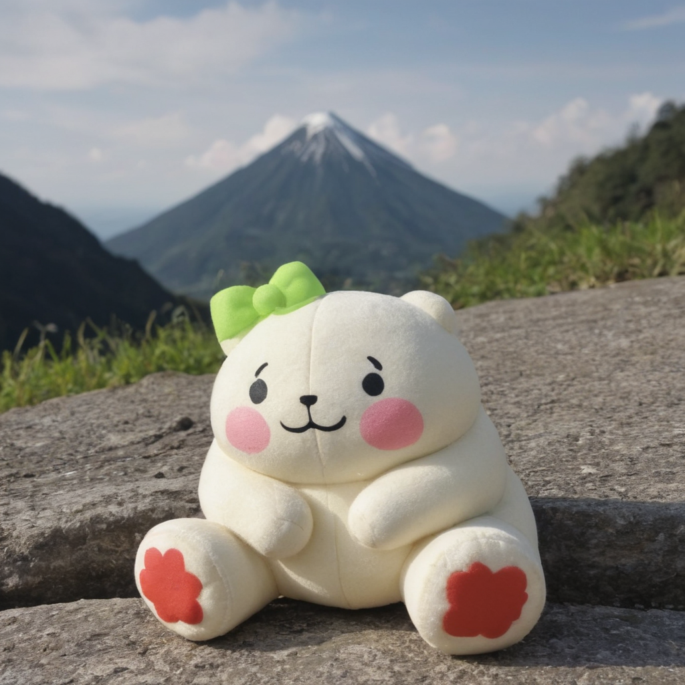
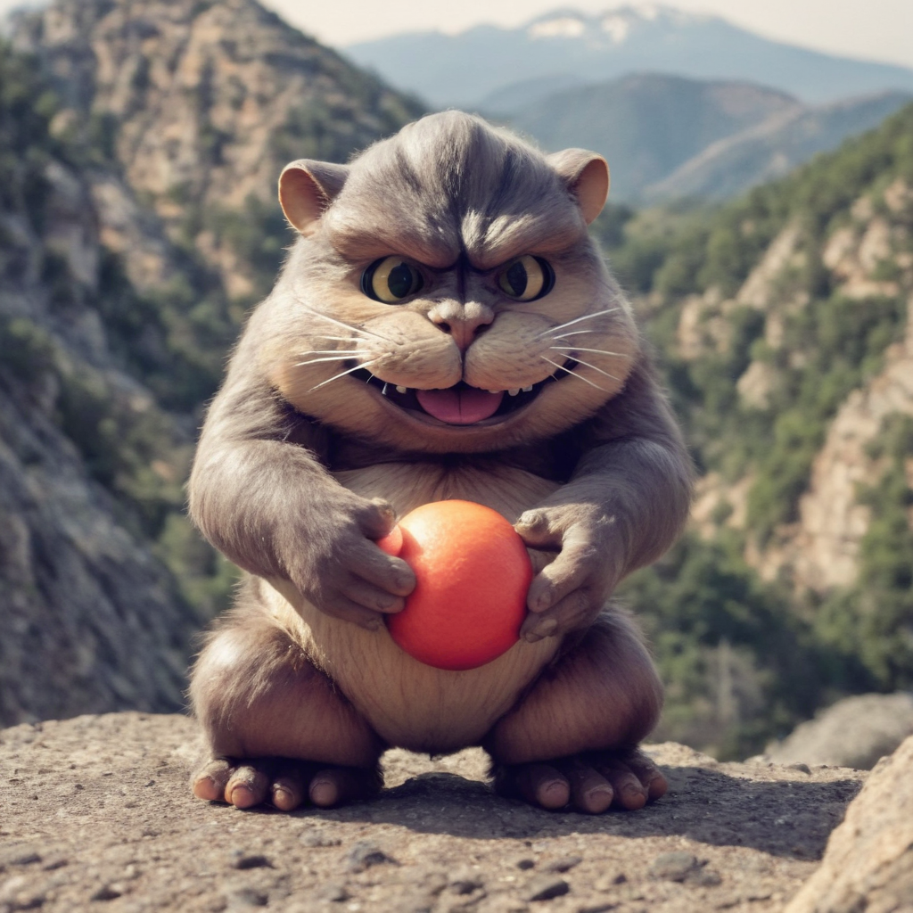

# Textual Inversion For LaMon

## Project Overview
This project represents an initial attempt at training a textual inversion model for LaMon, an SDXL-generated baby lava monster, using **[Photopedia XL](https://civitai.com/models/189109/photopedia-xl)** as the base model. While the results are not perfect, due to a limited training period of only a few hours on an A100, the model has managed to capture some of LaMon’s key features and characteristics.

## Model Goals
- **Generate LaMon in diverse contexts**: Enable users to create variations of LaMon in different environments and settings.
- **Textual Control**: Allow control over LaMon’s features, pose, and textures through text-based inputs.

## Features of LaMon
- **Unique Appearance**: LaMon has bold, large orange eyes, intricate stone-carved textures, and a playful yet slightly menacing expression.
- **Stylized Design**: Inspired by tiki culture, LaMon embodies a mix of ancient and mystical design influences.

## Base Model
We have used the **[Photopedia XL](https://civitai.com/models/189109/photopedia-xl)** model as the foundation for this project. Photopedia XL offers a rich and diverse set of visual features, making it an ideal starting point for LaMon's textual inversion model.

## Image Comparison

| Actual LaMon Image | Prompt: "A <lamon-toy> beside a mountain" (without textual inversion) | With Textual Inversion |
| --- | --- | --- |
|  |  |  |

## Download Model Weights
To begin, download, unzip, and place the necessary model weights:

```bash
pip install gdown==5.2.0
gdown 'https://drive.google.com/uc?id=1TjkRSjDaAkixo0tWOFQEXrnau-xwDNeY'

unzip model_weights.zip
rm -rf model_weights.zip
```

## Installation Steps for Local Environment
Set up a virtual environment:

```bash
python3 -m venv lamon_env
source lamon_env/bin/activate
pip install -r requirements.txt
```

## Dataset
The training dataset consists of only 10 images of LaMon in different settings and is created using **[CLAID AI](https://claid.ai/)**
Although I believe variety in these images would result in better quality output

## Training Process
The textual inversion model was trained using the following command:

```bash
accelerate launch train_textual_inversion_sdxl.py \
  --pretrained_model_name_or_path="./model_weights/photopediaXL_45/" \
  --train_data_dir="./images" \
  --learnable_property="object" \
  --placeholder_token="<lamon-toy>" \
  --initializer_token="toy" \
  --resolution=512 \
  --train_batch_size=5 \
  --gradient_accumulation_steps=4 \
  --max_train_steps=3000 \
  --learning_rate=5.0e-04 \
  --scale_lr \
  --lr_scheduler="constant" \
  --lr_warmup_steps=0 \
  --output_dir="./model_weights/textual_inversion_lamon"
```

## Usage
To generate images of LaMon using the trained model, simply run the following command:

```bash
python run_textual_inversion_lamon.py
```

This script will generate new images of LaMon based on textual inputs.

## Results
The model generates highly detailed and accurate images of LaMon based on text prompts, including variations in background, lighting, and environment while preserving the core characteristics of LaMon (eyes, stone-carved texture, etc.).

## Future Improvements
- **More Variations in Training Data**: To improve LaMon’s versatility in different environments and poses, additional training images with more diverse contexts are needed.
- **More Training Iterations**: Extending the training process with more iterations will help the model refine its understanding of LaMon’s unique characteristics and produce more consistent results.

    
### Feel free to contribute!  
## Don't forget to star the repo 😉